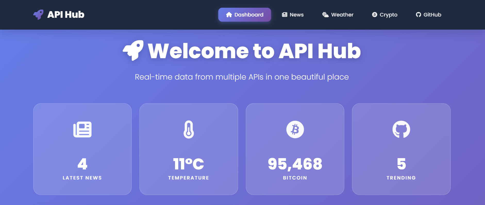
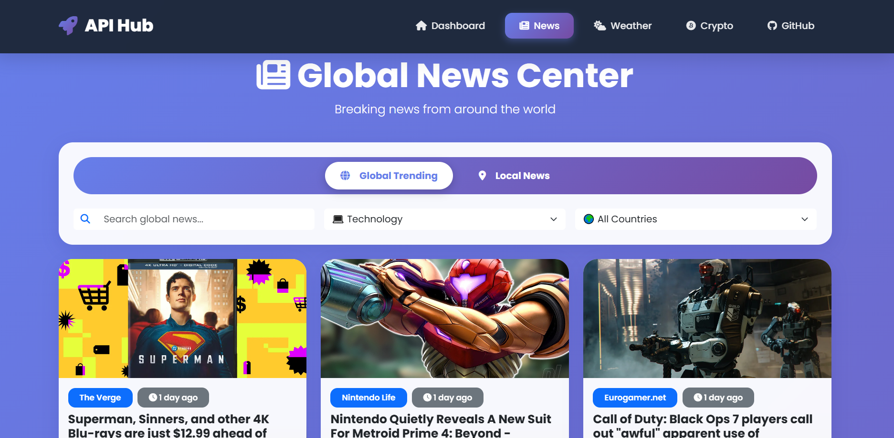
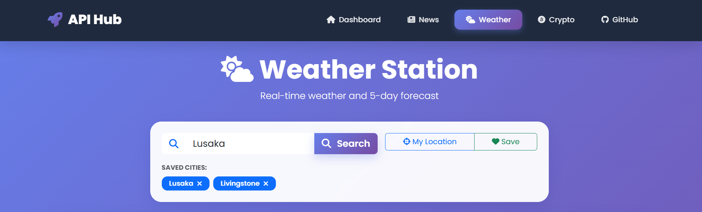
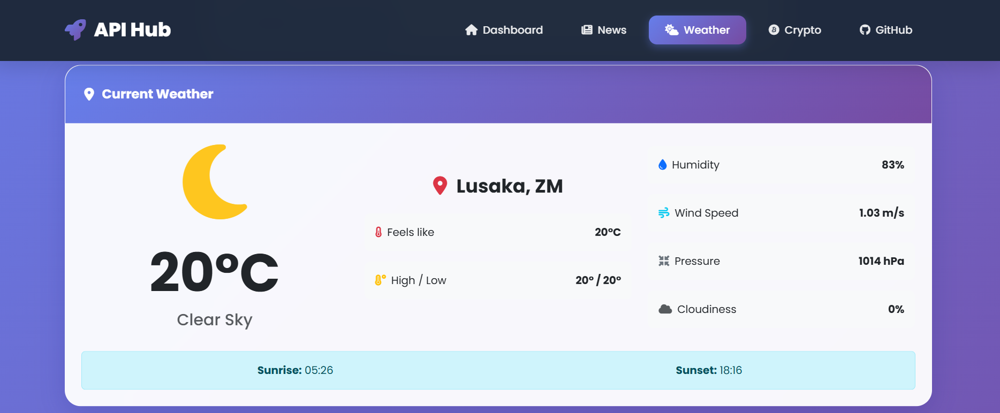
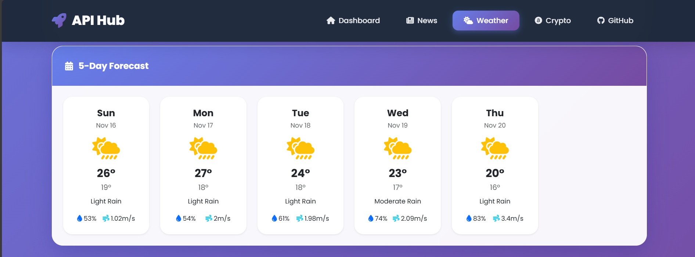
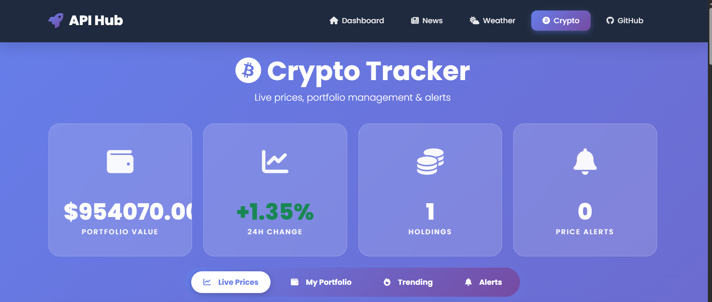
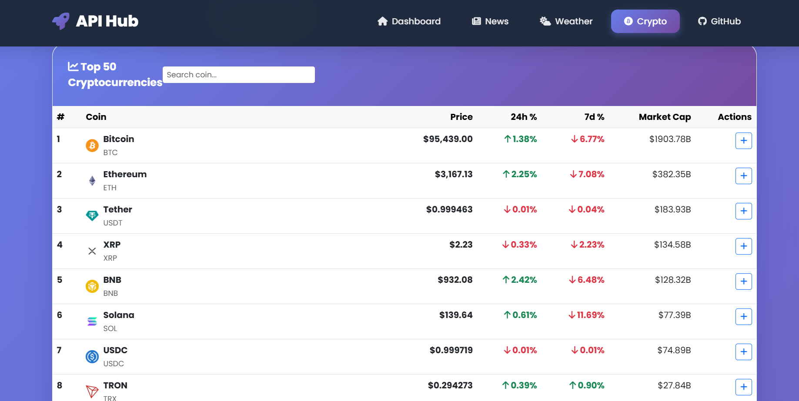

# 🚀 API Hub - Modern Multi-API Dashboard

A beautiful, modern web application built with Flask that aggregates data from multiple APIs into one stunning, interactive dashboard. No database required for basic features - everything runs in your browser!


---

## ✨ Key Features

### 🌍 Global & Local News Center
- **Global Trending News** from 13 countries
- **Local News Detection** - Auto-detect your location for city-specific news
- **7 News Categories** with emoji icons (Tech, Business, Sports, Health, etc.)
- **Real-time Search** with smart filtering
- **Load More** pagination for endless browsing

### 🌤️ Smart Weather Station
- **GPS Auto-Detection** - One-click location detection
- **Save Unlimited Cities** - Quick-access to your favorite locations
- **5-Day Detailed Forecast** - Temperature, humidity, wind, and more
- **Beautiful Weather Icons** - Visual weather representation
- **Sunrise/Sunset Times** - Plan your day better

### 💰 Crypto Portfolio Tracker
- **Live Prices** for 100+ cryptocurrencies
- **Portfolio Management** - Track your crypto investments
- **Profit/Loss Calculations** - See real-time gains and losses
- **Price Alerts** - Get notified when prices hit your targets
- **Trending Coins** - Discover what's hot in crypto
- **No API Key Required** - Uses free CoinGecko API

### 🐙 GitHub Repository Explorer
- **Search Millions of Repos** - Find any public repository
- **Trending Repos** - Daily, weekly, and monthly trends
- **Language Filtering** - Browse by programming language
- **Detailed Analytics** - Stars, forks, contributors, and more
- **Works Without Token** - 60 requests/hour (perfect for personal use)

---

## 🎨 Design Highlights

- ✨ **Modern Glassmorphism UI** - Frosted-glass effect cards
- 🎨 **Purple Gradient Background** - Eye-catching aesthetic
- 💫 **Smooth Animations** - Fade-in effects and hover transitions
- 📱 **Fully Responsive** - Perfect on mobile, tablet, and desktop
- 🎯 **Intuitive Navigation** - Clean, easy-to-use interface
- ⚡ **Fast Loading** - Optimized for performance

---

## 🚀 Quick Start (5 Minutes)

### 1️⃣ Clone & Setup
```bash
git clone https://github.com/b5119/flask-api-dashboard.git
cd flask-api-dashboard
python -m venv venv
source venv/bin/activate  # Windows: venv\Scripts\activate
pip install -r requirements.txt
```

### 2️⃣ Get FREE API Keys
**Takes 5 minutes total!** See [SETUP_GUIDE.md](SETUP_GUIDE.md) for detailed instructions.

- **NewsAPI** (2 min): https://newsapi.org/register
- **OpenWeatherMap** (2 min): https://openweathermap.org/api
- **GitHub Token** (1 min, optional): https://github.com/settings/tokens
- **CoinGecko**: No key needed! ✨

### 3️⃣ Create `.env` File
```env
SECRET_KEY=your-super-secret-key-change-this
NEWSAPI_KEY=your_newsapi_key_here
OPENWEATHER_API_KEY=your_openweathermap_key_here
GITHUB_TOKEN=optional_github_token
FLASK_ENV=development
```

### 4️⃣ Run!
```bash
python run.py
```

**Visit:** http://localhost:5000 🎉

---

## 📁 Project Structure
```
flask-api-dashboard/
├── app/
│   ├── __init__.py                      # Application factory + extensions initialization
│   ├── models.py                        # SQLAlchemy models (User, Articles, CryptoHoldings, etc.)
│   │
│   ├── api/                             # External API integrations (service layer)
│   │   ├── news_api.py                  # NewsAPI service wrapper
│   │   ├── weather_api.py               # OpenWeatherMap service wrapper
│   │   ├── crypto_api.py                # CoinGecko client utilities
│   │   ├── github_api.py                # GitHub REST API wrapper
│   │   ├── tracker.py                   # Crypto alerting + portfolio tracking tools
│   │   └── github_analytics_core.py     # GitHub repo analytics engine
│   │
│   ├── routes/                          # Route handlers (controllers)
│   │   ├── main.py                      # Dashboard home view
│   │   ├── news.py                      # News routes
│   │   ├── weather.py                   # Weather routes
│   │   ├── crypto.py                    # Crypto tracking routes
│   │   └── github.py                    # GitHub stats/explorer routes
│   │
│   ├── templates/                       # Jinja2 HTML views
│   │   ├── base.html                    # Shared base layout
│   │   ├── index.html                   # Main dashboard UI
│   │   ├── news.html                    # News UI
│   │   ├── weather.html                 # Weather UI
│   │   ├── crypto.html                  # Crypto portfolio UI
│   │   └── github.html                  # GitHub analytics UI
│   │
│   ├── static/                          # Frontend assets
│   │   ├── css/
│   │   │   └── style.css                # Global styling
│   │   ├── js/
│   │   │   └── main.js                  # Interactive UI logic
│   │   └── img/                         # Logos, screenshots, icons
│   │
│   └── __init__.py                      # Package init
│
├── config.py                             # Configuration classes (Production, Dev, Test)
├── run.py                                # App entry point
├── requirements.txt                      # Python dependency list
│
├── SETUP_GUIDE.md                        # How to install & run the project
├── IMPROVEMENTS.md                       # Future upgrade notes
└── README.md                             # Project documentation
```

## 🛠️ Technology Stack

### Backend
| Technology | Version | Purpose |
|------------|---------|---------|
| Flask | 3.0.0 | Web framework |
| Flask-SQLAlchemy | 3.1.1 | Database ORM |
| Flask-Migrate | 4.0.5 | Database migrations |
| Requests | 2.31.0 | HTTP library |
| Python-dotenv | 1.0.0 | Environment variables |

### Frontend
| Technology | Purpose |
|------------|---------|
| Bootstrap 5 | Responsive CSS framework |
| jQuery 3.7.1 | DOM manipulation & AJAX |
| Font Awesome 6.4 | Beautiful icons |
| Google Fonts (Poppins) | Modern typography |
| Custom CSS | Glassmorphism effects |

### APIs Integrated
| API | Cost | Usage Limit | Purpose |
|-----|------|-------------|---------|
| NewsAPI | FREE | 100 req/day | News articles from 90+ sources |
| OpenWeatherMap | FREE | 1,000 req/day | Weather data & forecasts |
| CoinGecko | FREE | Unlimited ✨ | Cryptocurrency prices |
| GitHub | FREE | 60 req/hour (5K with token) | Repository data |

---

## 🎯 Feature Deep-Dive

### 📰 News Center

#### Global News
- **13 Countries Supported**: 🇺🇸 🇬🇧 🇨🇦 🇦🇺 🇩🇪 🇫🇷 🇯🇵 🇮🇳 🇨🇳 🇧🇷 🇿🇦 🇳🇬 🇰🇪
- **7 Categories**: General, Business, Technology, Entertainment, Health, Science, Sports
- **Real-time Search**: 500ms debounce for efficient API usage
- **Smart Filtering**: Combine country + category + search
- **Load More**: Infinite scroll with pagination

#### Local News
- **GPS Detection**: Browser geolocation API
- **City-Specific News**: Get news from your location
- **Smart Fallback**: Shows country news if city news unavailable
- **One-Click Location**: "Detect Location" button

**Example Usage:**
```
1. Click "Local News" tab
2. Click "Detect Location" → Allow browser permission
3. See news specific to your city!
4. Filter by category for focused content
```

---

### 🌤️ Weather Station

#### Key Features
- **Auto-Detection**: Uses browser GPS to find your city
- **Save Cities**: Unlimited favorite locations in localStorage
- **5-Day Forecast**: Detailed predictions with hourly breakdown
- **Visual Icons**: Weather-specific icons (sun, cloud, rain, etc.)
- **Detailed Metrics**: Temperature, humidity, wind, pressure, cloudiness

#### Smart Features
- **Default City Memory**: Remembers last searched city
- **Quick Switch**: Click any saved city badge for instant weather
- **Beautiful Cards**: Modern forecast cards with daily summaries
- **Sunrise/Sunset**: Plan your day around daylight hours

**Example Usage:**
```
1. Click "My Location" → Auto-loads your weather
2. Search "Tokyo" → See Tokyo's weather
3. Click "Save" → Tokyo added to favorites
4. Click "Tokyo" badge anytime → Instant weather
```

---

### 💰 Crypto Portfolio Tracker

#### Portfolio Management
- **Add Holdings**: Track any cryptocurrency you own
- **Real-time Valuation**: See current value of your portfolio
- **Profit/Loss Tracking**: 
  - $ gain/loss per holding
  - % gain/loss with color coding
  - Total portfolio P/L
- **Purchase History**: Remember when and at what price you bought

#### Price Alerts
- **Set Targets**: Alert when price goes above/below target
- **Multiple Alerts**: Unlimited price alerts
- **Easy Management**: View and remove alerts anytime
- **LocalStorage**: No server required, saved in browser

#### Live Prices
- **Top 50 Coins**: Sorted by market cap
- **Search Coins**: Find any crypto quickly
- **Quick Add**: One-click portfolio addition from price table
- **Detailed Metrics**: Price, 24h/7d change, market cap
- **Auto-Refresh**: Updates every 60 seconds

**Example Usage:**
```
Portfolio:
1. Go to "My Portfolio" tab
2. Enter: bitcoin, amount: 0.5, price: $40,000
3. Click "Add to Portfolio"
4. See real-time value and profit/loss!

Alerts:
1. Go to "Alerts" tab
2. Enter: bitcoin, target: $50,000, condition: above
3. Create alert
4. Get notified when Bitcoin hits $50K
```

---

### 🐙 GitHub Explorer

#### Search & Discovery
- **Repository Search**: Find any public repository
- **Trending Repos**: See what's hot (daily/weekly/monthly)
- **Language Filter**: Browse by programming language
- **Detailed Info**: Stars, forks, description, language

#### Analytics (Existing)
- **Repository Details**: Full metadata
- **Contributors**: See who's building the project
- **Languages**: Code language breakdown
- **Commits**: Recent activity
- **Issues & PRs**: Development status

**No Token Required**: Works out-of-the-box with 60 requests/hour!

---

## 💾 Data Persistence (No Database Required!)

### LocalStorage Strategy
All user preferences saved in browser (no server-side database needed):

#### Weather
```javascript
localStorage.setItem('weather_saved_cities', ['London', 'Tokyo', 'Paris']);
localStorage.setItem('weather_default_city', 'London');
```

#### Crypto
```javascript
localStorage.setItem('crypto_portfolio', [{
  id: 1234567890,
  coinId: 'bitcoin',
  amount: 0.5,
  purchasePrice: 40000,
  purchaseDate: '2025-01-01'
}]);

localStorage.setItem('crypto_alerts', [{
  coinId: 'ethereum',
  targetPrice: 3000,
  condition: 'above'
}]);
```

### Benefits
- ✅ **No Database Setup**: Works immediately
- ✅ **Privacy-Friendly**: Data stays on your device
- ✅ **Instant Access**: No server round-trips
- ✅ **Offline-Ready**: Saved data available offline
- ✅ **No Authentication Required**: Start using immediately

---

## 🎨 UI/UX Features

### Modern Design
- **Glassmorphism**: Frosted-glass effect with backdrop blur
- **Gradient Background**: Purple gradient (667eea → 764ba2)
- **Poppins Font**: Modern, clean typography
- **Smooth Animations**: CSS transitions and keyframes
- **Hover Effects**: Scale transforms and shadow effects

### User Experience
- **Toast Notifications**: Non-intrusive success/error messages
- **Loading Spinners**: Animated while fetching data
- **Empty States**: Helpful messages when no data
- **Error Handling**: Clear error messages with recovery options
- **Responsive Design**: Mobile-first approach

### Accessibility
- Color contrast ratios meet WCAG standards
- Keyboard navigation support
- Screen reader friendly
- Focus indicators on interactive elements

---

## 📊 API Usage & Limits

### Free Tier Comparison

| API | Free Limit | Perfect For | Upgrade |
|-----|-----------|-------------|---------|
| **NewsAPI** | 100 req/day | ✅ Check news 4-5 times daily | $449/month |
| **OpenWeatherMap** | 1,000 req/day | ✅ Check every 2 minutes! | $40/month |
| **GitHub (no token)** | 60 req/hour | ✅ Casual browsing | FREE (5K with token) |
| **CoinGecko** | Unlimited | ✅ No restrictions! | Always free ❤️ |

**💡 Pro Tip:** Free tiers are MORE than enough for personal use!

---

## 🚀 Performance Optimizations

### Backend
- **Efficient API Calls**: Batch requests where possible
- **Error Handling**: Graceful fallbacks for API failures
- **Request Timeouts**: 10-second timeout on all API calls
- **Class-based APIs**: Reusable, maintainable code

### Frontend
- **Debounced Search**: 500ms delay prevents excessive API calls
- **Lazy Loading**: Load data only when tabs are active
- **Auto-Refresh**: Smart refresh only for visible content
- **Image Optimization**: Placeholder images for missing content
- **LocalStorage Caching**: Reduce server requests

### User Experience
- **Optimistic UI**: Instant feedback before API response
- **Progressive Enhancement**: Works even if some APIs fail
- **Graceful Degradation**: Fallbacks for missing data
- **Loading States**: Visual feedback during data fetch

---

## 🔒 Security

### Current Implementation
- ✅ **Environment Variables**: Sensitive data in `.env`
- ✅ **No API Keys in Frontend**: All keys server-side
- ✅ **CSRF Protection**: Flask-WTF enabled
- ✅ **SQL Injection Prevention**: SQLAlchemy ORM
- ✅ **XSS Protection**: Jinja2 auto-escaping

### Best Practices
- Change `SECRET_KEY` to random string
- Never commit `.env` to version control
- Use HTTPS in production
- Keep dependencies updated
- Validate all user inputs

---

## 🧪 Testing Your Setup

### Quick Health Check
```bash
# Visit this endpoint after starting server
curl http://localhost:5000/test-apis

# Expected response:
{
  "news": "OK",
  "weather": "OK", 
  "crypto": "OK",
  "github": "OK"
}
```

### Test Each Feature
1. **Dashboard**: Should show 4 stat cards with data
2. **News**: Should load articles (may take 15s for weather key activation)
3. **Weather**: Click "My Location" → Should detect your city
4. **Crypto**: Should show Top 50 coins immediately
5. **GitHub**: Should show trending repositories

---

## 🐛 Troubleshooting

### Common Issues

#### "API key not found"
```bash
# Solution:
1. Check .env file exists in project root
2. Verify key names: NEWSAPI_KEY, OPENWEATHER_API_KEY
3. Restart Flask server after editing .env
```

#### Weather API not working
```bash
# Solution:
1. Wait 10-15 minutes after getting key (activation time)
2. Test key manually:
   curl "https://api.openweathermap.org/data/2.5/weather?q=London&appid=YOUR_KEY"
```

#### Location detection not working
```bash
# Solution:
1. Click "Allow" when browser asks for location permission
2. Use HTTPS (geolocation requires secure context)
3. Try manual city search instead
```

#### News only showing US articles
```bash
# Solution:
1. Check you selected correct country in dropdown
2. Try "Global" + different country combination
3. For local news, click "Detect Location" first
```

---

## 🎯 Roadmap & Future Features

### Phase 1 (Completed) ✅
- ✅ Global + Local News with GPS
- ✅ Portfolio tracker with P/L
- ✅ Price alerts system
- ✅ Weather GPS detection
- ✅ Save favorite cities
- ✅ Modern glassmorphism UI
- ✅ LocalStorage persistence

### Phase 2 (Planned) 🚧
- [ ] User authentication (Flask-Login)
- [ ] Cloud-sync preferences
- [ ] Browser push notifications
- [ ] Export portfolio to PDF/CSV
- [ ] Dark mode toggle
- [ ] News article bookmarking
- [ ] Weather alerts
- [ ] Crypto price charts

### Phase 3 (Future) 🔮
- [ ] Mobile app (React Native)
- [ ] Real-time WebSocket updates
- [ ] Advanced analytics dashboard
- [ ] Social features (share portfolios)
- [ ] Multi-language support
- [ ] Machine learning predictions
- [ ] Tax calculation for crypto

---

## 🤝 Contributing

Contributions are welcome! Here's how:

1. **Fork** the repository
2. **Create** a feature branch
   ```bash
   git checkout -b feature/AmazingFeature
   ```
3. **Commit** your changes
   ```bash
   git commit -m 'Add: Amazing new feature'
   ```
4. **Push** to the branch
   ```bash
   git push origin feature/AmazingFeature
   ```
5. **Open** a Pull Request

### Contribution Guidelines
- Follow PEP 8 style guide
- Add comments for complex logic
- Update README if adding features
- Test your changes thoroughly
- Keep commits atomic and descriptive

---
## 👤 Author

**Frank Bwalya**
- GitHub: [b5119](https://github.com/b5119)
- Email: bwalyafrank61@gmail.com


---

## 🙏 Acknowledgments

### APIs & Services
- **NewsAPI** - For news article data
- **OpenWeatherMap** - For weather information
- **CoinGecko** - For cryptocurrency data
- **GitHub API** - For repository information

### Libraries & Frameworks
- **Flask** - Excellent web framework
- **Bootstrap** - Beautiful CSS framework
- **Font Awesome** - Amazing icon library
- **jQuery** - Simplified JavaScript

### Inspiration
- Modern dashboard designs on Dribbble
- Glassmorphism UI trend
- Community feedback and suggestions

---

## 📧 Support

Need help? Here's how to get it:

1. **Check Documentation**: Read SETUP_GUIDE.md
2. **Search Issues**: See if someone had the same problem
3. **Open Issue**: Describe your problem with error messages
4. **Email**: bwalyafrank61@gmail.com
---

## ⭐ Star This Project

If you find this project useful, please consider giving it a star! ⭐

It helps others discover the project and motivates continued development.

---

## 📸 Screenshots

### Dashboard Home

Beautiful overview with real-time stats from all APIs

### News Center

Global and local news with smart filtering

### Weather Station



5-day forecast with GPS auto-detection

### Crypto Portfolio


Track your investments with profit/loss calculations


---

## 🎉 Final Notes

This project demonstrates:
- ✅ Clean Flask architecture
- ✅ Modern UI/UX design
- ✅ Multiple API integrations
- ✅ LocalStorage for persistence
- ✅ Responsive design
- ✅ No database required for basic features
- ✅ Production-ready code

**Perfect for:**
- Learning Flask development
- Building API integrations
- Creating dashboards
- Portfolio projects
- Personal use

---

Made with ❤️ and Flask | © 2025 API Hub